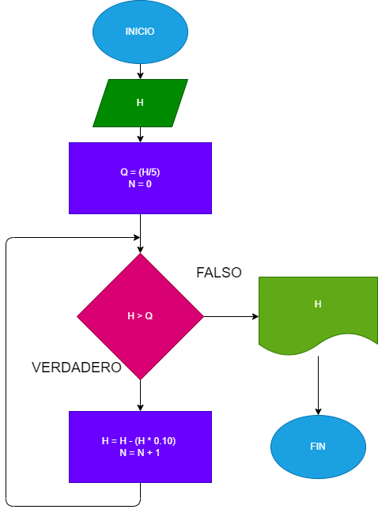

# Proyecto No. 13

Una pelota se deja caer desde una altura h y en cada rebote sube el 10% menos de la anterior. Hacer el diagrama de flujo y el programa en python, que lea h y que calcule e imprime en cual rebote la pelota no alcanza a subir la quinta parte de la altura inicial.

# Diagrama de flujo

